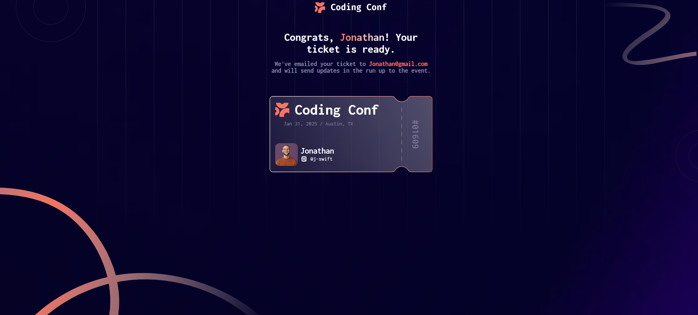

# Frontend Mentor - Conference Ticket Generator

This is a solution to the [Conference Ticket Generator challenge on Frontend Mentor](https://www.frontendmentor.io). Frontend Mentor challenges help you improve your coding skills by building realistic projects. 

---

## 📸 Screenshot

---

## 🔗 Links

- **Solution URL:** [GitHub Repo](https://github.com/Ksingh-pranjal/conference-ticket-generator)  
- **Live Site URL:** [GitHub Pages](https://ksingh-pranjal.github.io/conference-ticket-generator/)  

---

## 💻 Built with

- Semantic **HTML5** markup  
- **CSS3** (Flexbox, Grid, Responsive Design)  
- **JavaScript** (Form handling & ticket generation)  
- Git & GitHub for version control  
- GitHub Pages for deployment  

---

## 🚀 Features

- Responsive form for ticket generation  
- Dynamic ticket preview  
- Mobile-first workflow  
- Modern and clean UI design  

---

## 📚 What I learned

While working on this project, I improved my skills in:

- Handling forms with JavaScript  
- Applying responsive design principles  
- Organizing assets & project structure  
- Using Git & GitHub for project management  
- Deploying sites with GitHub Pages  

---

## 🙌 Acknowledgments

Challenge by [Frontend Mentor](https://www.frontendmentor.io).  
Coded by **Pranjal Singh**.  
